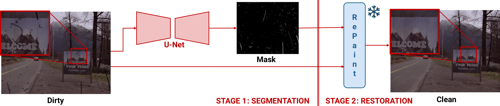

# From Dust to Detail: Deep Learning Pipelines for Analog Film Restoration


*A two-stage pipeline combining segmentation and inpainting for analog film restoration.*

## Abstract

This project explores deep learning strategies for the digital restoration of analog film, focusing specifically on 35mm scans. Restoration of such materials is traditionally manual and time-consuming, but recent advances in computer vision allow for scalable, automated alternatives. This work evaluates two architectures:

1. A **modular pipeline** that segments damage and inpaints selectively using RePaint.
2. An **end-to-end transformer-based model**, adapted from Restormer.

Both methods aim to remove artifacts such as **dust, dirt, scratches, and burns** while preserving natural film grain. The models are trained on a custom synthetic dataset and evaluated using SSIM, PSNR, LPIPS, and qualitative analysis.

---

##  Objectives

- Develop a selective restoration pipeline tailored for analog film.
- Compare modular (segmentation + inpainting) and end-to-end transformer architectures.
- Construct a realistic, domain-specific synthetic dataset with pixel-accurate degradation masks.
- Preserve **film grain** during restoration to ensure archival fidelity.
- Evaluate models using objective metrics and qualitative visual inspection.

---

##  Repository Structure
<pre lang="markdown"> ```text TFG_Complete/ # Main project directory ├── Artifact_Creation/ # Scripts and modules to generate synthetic artifacts and datasets │ ├── damage_generator/ # Core damage generation code and helpers │ └── scans/ # Sample scan images and corresponding annotations ├── imgs/ # Diagrams and figures used in the project └── Informes/ # Reports and documentation (initial report, LaTeX files) └── InformeInicial/ # Initial report files including source and PDF output ``` </pre>
---
##  Dossier Timeline
The timeline and history of changes in the project, as well as its objectives and tasks can be consulted in the progress reports, in the Informes folder in this repo.

---

## Methodology Overview

### Modular Two-Stage Pipeline

1. **Segmentation:** Three U-Net variants (Vanilla, Attention U-Net, R2AttUNet) identify artifact regions in degraded frames.
2. **Inpainting:** RePaint is used to restore only masked regions, leveraging a DDPM-based iterative denoising process.


*Examples of synthetic artifacts added: dust, dirt, hair, scratches.*


*Schematic of the modular pipeline: segmentation + inpainting using RePaint.*

### End-to-End Restormer Model

A transformer-based model (Restormer) was trained from scratch and with fine-tuning to perform complete restoration in one pass. Improvements included:

- Dataset scaling (from 1.3k to 5k image pairs)
- Loss reweighting with artifact-aware masks
- Finetuning from a deraining model for transfer learning
- Use of extended patches for better contextual modeling


*Restormer's architecture enables high-resolution modeling of film artifacts.*

---

## Results Summary

| Model                          | LPIPS ↓ | PSNR ↑ | SSIM ↑ | Inference Time ↓ |
|-------------------------------|---------|--------|--------|------------------|
| Two-Stage (Pretrained U-Net)  | 0.0396  | 25.69  | 0.9760 | 396s             |
| Two-Stage (Pretrained AttU-Net)| 0.0393 | 26.18  | 0.9760 | 432s             |
| **One-Stage (Restormer)**     | **0.0027** | **36.12** | **0.9984** | **1.32s** |


*Result comparison*
---

## Dataset

- **Synthetic Dataset**: Custom-built using uncompressed Blu-ray frames from 35mm films. Augmented with over 6,000 pixel-level damage masks (via FILM-AA methodology).
- **Documartica Dataset**: Used for pretraining. Simulates film damage on stills, aiding in domain-aligned weight initialization.

All datasets emphasize **grain preservation**, realistic degradation, and diverse film aesthetics.

---